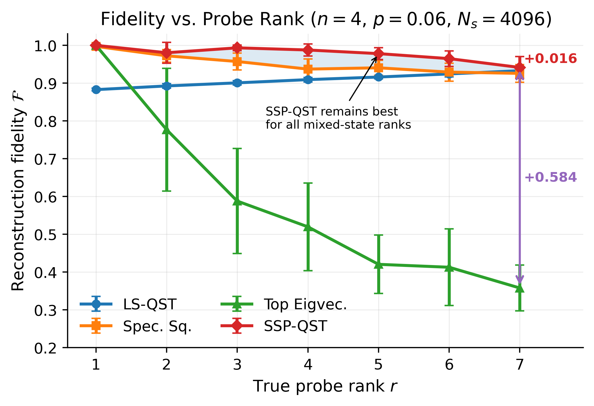
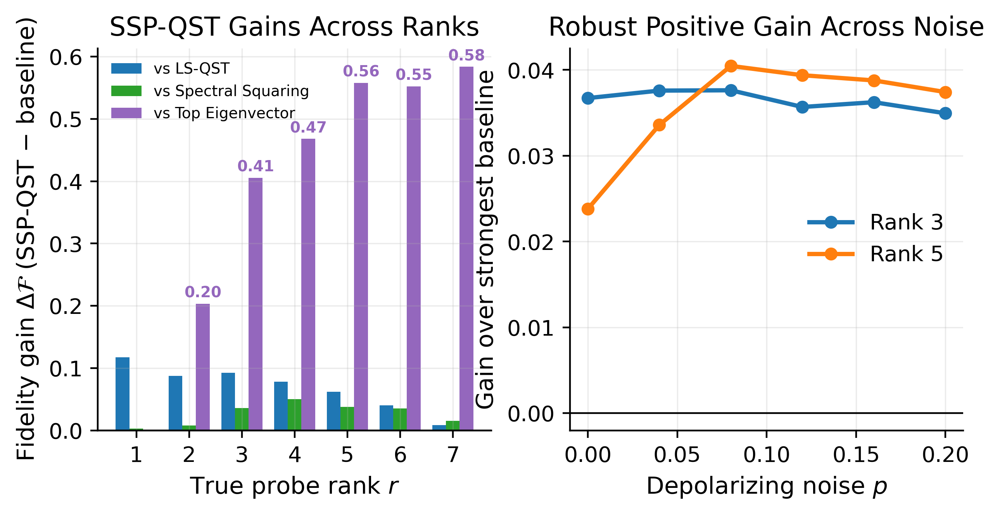
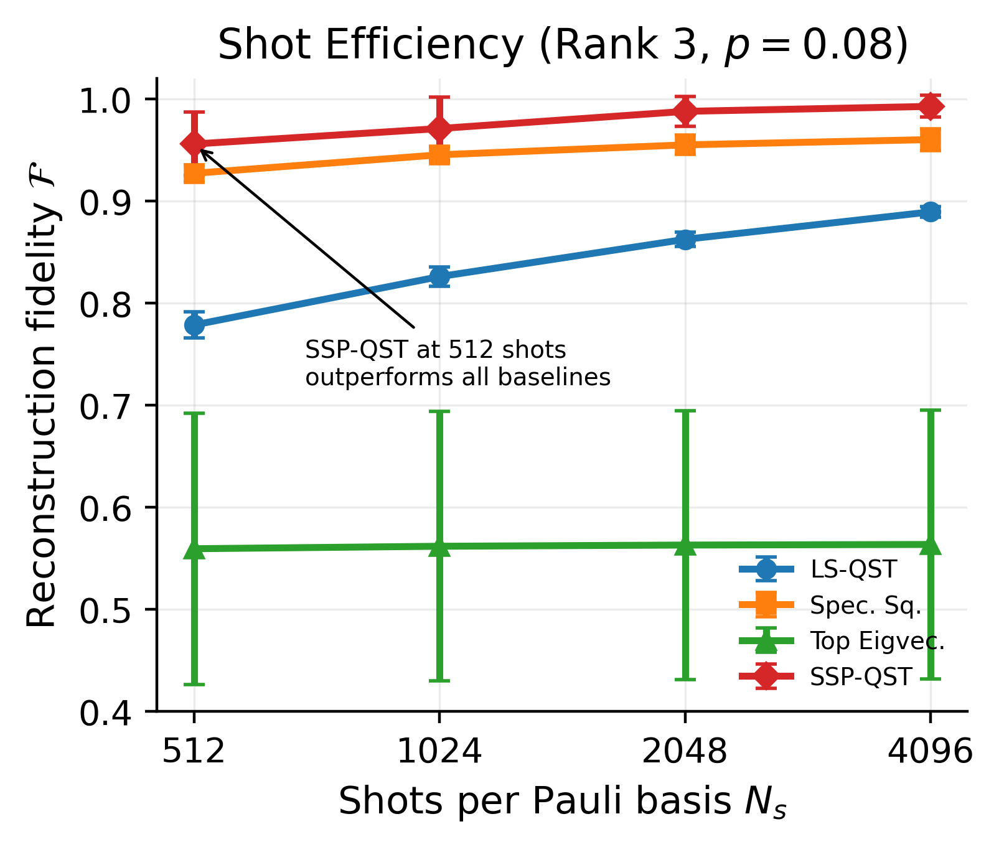
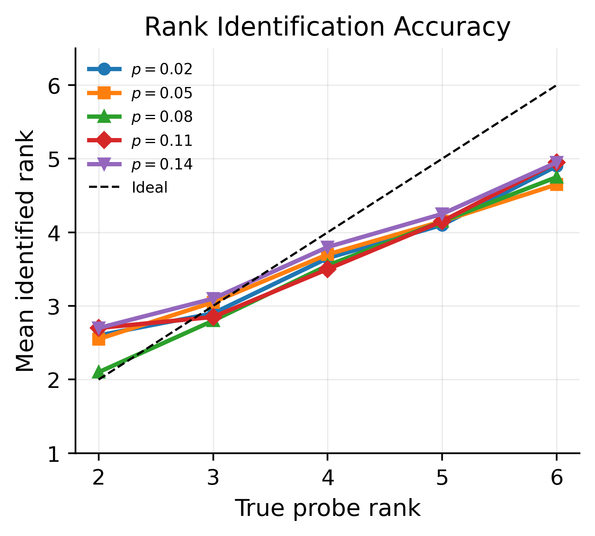
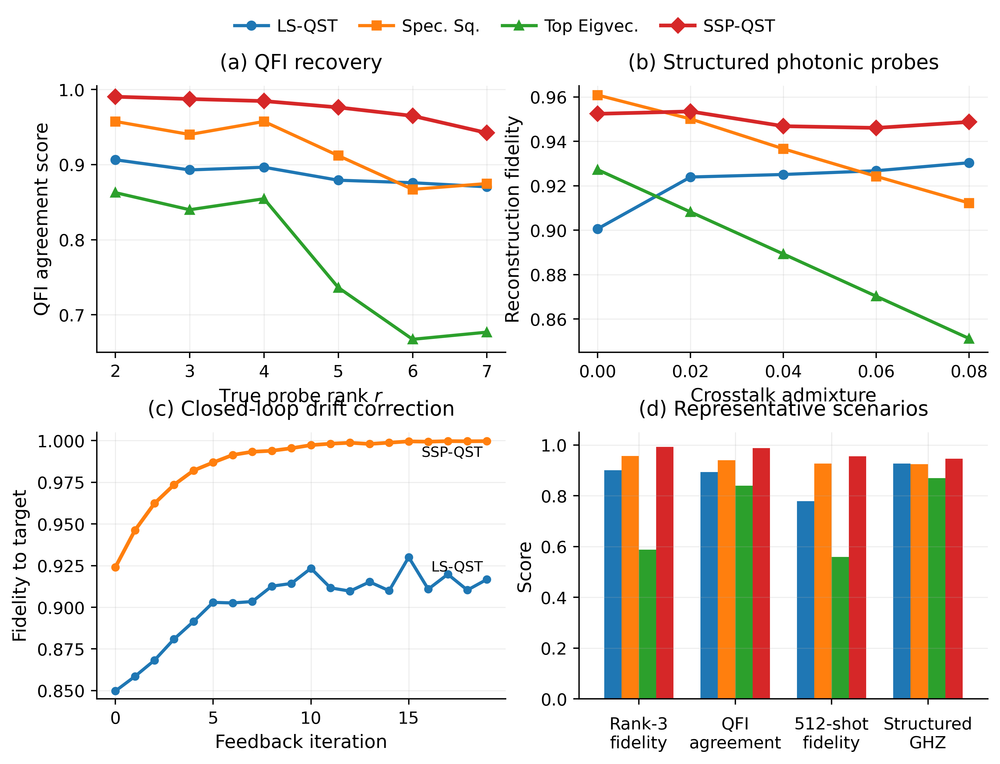

# SSP-QST: Spectral Subspace Purification for Photonic Quantum State Tomography

Official code for the IEEE QCE26 (IEEE Quantum Week 2026) Technical Paper:

> **SSP-QST: Spectral Subspace Purification for Photonic Quantum State Tomography**
> Anuvab Sen, Saibal Mukhopadhyay
> Georgia Institute of Technology
> IEEE International Conference on Quantum Computing and Engineering (QCE), 2026. Paper ID QPHO-981.

SSP-QST is a closed-form, rank-adaptive post-processing layer for least-squares quantum state tomography. It eigendecomposes the LS estimate, computes a Weyl-perturbation noise floor directly from the measured spectrum, applies a rank-1 override, truncates sub-floor eigenmodes, and renormalises. One eigendecomposition, O(d^3), no rank prior, no iteration.

```
eps_th = p_hat / (d - 1) + 0.5 / sqrt(N_s),   p_hat = max(0, 1 - lambda_max)
```

<p align="center">
  
</p>

## Headline results (n = 4, p = 0.06, N_s = 4096)

| Rank r | LS-QST | Spectral Squaring | Top Eigenvector | SSP-QST |
|-------:|-------:|------------------:|----------------:|--------:|
| 1 | 0.883 | 0.997 | 1.000 | **1.000** |
| 2 | 0.892 | 0.972 | 0.777 | **0.980** |
| 3 | 0.901 | 0.957 | 0.588 | **0.993** |
| 4 | 0.909 | 0.937 | 0.520 | **0.987** |
| 5 | 0.916 | 0.940 | 0.420 | **0.978** |
| 6 | 0.924 | 0.929 | 0.412 | **0.965** |
| 7 | 0.933 | 0.926 | 0.358 | **0.941** |

- Highest fidelity among tested non-iterative methods at every probe rank, with gains up to +0.584 over top-eigenvector extraction and +0.051 over spectral squaring.

<p align="center">
  
</p>
- At least 8x photon-budget reduction: SSP-QST at N_s = 512 (F = 0.956) exceeds LS-QST at N_s = 4096 (F = 0.890).

<p align="center">
  
</p>
- Runtime-matched against iterative maximum likelihood: the entire SSP-QST step (~0.16 ms) costs less than one R-rho-R iteration (~4 ms); 400 iterations (~10^4x compute) still trail SSP-QST at every rank.
- Exact rank identification for all ranks 2 through 6 at p <= 0.10 (20/20 trials per point).

<p align="center">
  
</p>

## Additional validation

QFI agreement, structured photonic GHZ probes with crosstalk, closed-loop drift correction, and best-method scenario summary:

<p align="center">
  
</p>

## Installation

```bash
pip install numpy scipy matplotlib
```

Optional, for the legacy Qiskit pipeline only:

```bash
pip install qiskit qiskit-aer   # verified on Qiskit 2.5.1 + Aer 0.17.2
```

## Quickstart

Reproduce every figure and table in the paper (deterministic seeds, byte-for-byte):

```bash
python experiments/run_all_figures.py     # ~10-20 min, outputs to ./figs/
```

Reproduce the iterative-ML comparison:

```bash
python experiments/run_ml_comparison.py            # undiluted RrhoR, two budgets
python experiments/run_ml_comparison.py --diluted  # step-size-optimised diluted variant
```

Verify the theoretical bounds quoted in the paper:

```bash
python experiments/verify_bounds.py     # ~1-2 min
```

## Repository structure

```
.
├── ssp_qst/                       # Library: the method and its physics
│   ├── paulis.py                  #   Pauli operators, n-qubit measurement basis
│   ├── states.py                  #   Probe states: Haar rank-r mixtures, GHZ variants
│   ├── simulator.py               #   Noise channels + LS-QST measurement simulator
│   ├── purification.py            #   SSP-QST (Algorithm 1 of the paper)
│   ├── baselines.py               #   Spectral squaring, top eigenvector
│   ├── metrics.py                 #   Uhlmann fidelity, quantum Fisher information
│   └── protocols.py               #   One deterministic experiment per paper figure/table
├── experiments/
│   ├── run_all_figures.py         # Regenerates every paper figure and table
│   ├── run_ml_comparison.py       # RrhoR maximum likelihood (+ --diluted mode)
│   └── verify_bounds.py           # Amplitude-damping and matrix-Bernstein checks
├── figs/                          # Paper figures (PNG) + verified numeric summaries
├── legacy/
│   ├── reference/                 # Original flat scripts (byte-for-byte provenance)
│   └── v4/, v5/                   # Earlier Qiskit Aer pipeline and n = 3 experiments
├── requirements.txt
└── README.md
```

Every function in `ssp_qst/` is verbatim from the verified reference
implementation (`legacy/reference/`); the split into modules is verified to
reproduce all seven experiment protocols exactly, array-for-array.

## Minimal usage

```python
from ssp_qst import random_rank_state, depolarize, ls_qst_from_state, ssp_qst, fidelity

target = random_rank_state(n=4, r=3, seed=7)
rho_ls = ls_qst_from_state(depolarize(target, 0.06), n=4, Ns=4096, seed=11)
rho    = ssp_qst(rho_ls, Ns=4096)
print(fidelity(rho, target))            # ~0.99
```

Or standalone, the entire method in fifteen lines:

```python
import numpy as np

def ssp_qst(rho_ls, Ns):
    d = rho_ls.shape[0]
    vals, vecs = np.linalg.eigh((rho_ls + rho_ls.conj().T) / 2)
    vals = np.maximum(vals, 0.0)
    p_hat = max(0.0, 1.0 - vals[-1])
    eps = p_hat / (d - 1) + 0.5 / np.sqrt(Ns)
    if vals[-2] < 2 * eps:                      # rank-1 override
        v = vecs[:, -1]
        return np.outer(v, v.conj())
    vals = np.where(vals > eps, vals, 0.0)
    vals /= vals.sum()
    return (vecs * vals) @ vecs.conj().T
```

## Key functions (ssp_qst package)

| Function | Role |
|---|---|
| `random_rank_state(n, r, seed)` | Haar frame (Ginibre + QR) with flat Dirichlet weights |
| `ls_qst_from_state(...)` | LS-QST with analytic Bernoulli shot noise |
| `ssp_qst(rho_ls, Ns)` | Algorithm 1: Weyl noise floor, rank-1 override, truncate, renormalise |
| `spectral_squaring`, `top_eigvec` | Non-iterative baselines |
| `qfi(rho, H)` | Quantum Fisher information |
| `physical_structured_ghz(...)` | GHZ probes with leakage, dephasing, crosstalk |
| `compute_closed_loop(...)` | Parameter-shift feedback simulation |

All figure annotations are computed from the plotted data at render time; nothing is hardcoded.

## Reproducibility notes

- All randomness is deterministically seeded. Rerunning `experiments/run_all_figures.py` regenerates `figs/selected_results_summary.txt` byte-for-byte.
- The legacy `v4`/`v5` code uses the same threshold but predates the rank-1 override of Algorithm 1, so its rank-1 fidelities (~0.95) sit below the camera-ready value (1.000). Legacy experiments are n = 3 at p = 0.08; all paper results are n = 4. Point the `sys.path.insert` line in `v5/rank_experiments.py` at the directory containing `ssp_qst_core.py` before running.
- Wall times in the ML comparison are machine dependent; all fidelities are deterministic.

## Citation

```bibtex
@inproceedings{sen2026sspqst,
  author    = {Sen, Anuvab and Mukhopadhyay, Saibal},
  title     = {{SSP-QST}: Spectral Subspace Purification for Photonic Quantum State Tomography},
  booktitle = {IEEE International Conference on Quantum Computing and Engineering (QCE)},
  year      = {2026}
}
```

## Contact

Anuvab Sen, asen74@gatech.edu
GREEN Lab, School of Electrical and Computer Engineering, Georgia Institute of Technology
